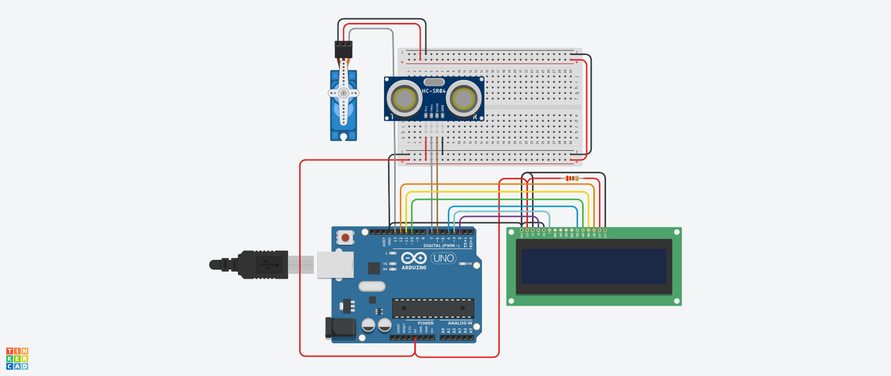

# 2do Parcial SPD

## Integrantes
* Juliana Grajeda
* Coanque Miriam
* Vallina Santiago
* Flores Cruz Matias Ezequiel
* Franco Francisco Ezequiel

## Proyecto: Alimentador de mascotas

## Descripción
El proyecto tiene la función de abrir una compuerta representado por el servo motor el cual cumple su función en base al sensor de distancia para detectar a la mascota cuando esta se acerca, la pantalla lcd muestra un mensaje cuando la comida se sirvió.

## Función principal
Esta función se encarga de controlar el sensor de distancia.

    float calcular_distancia()
    {
        digitalWrite(TRIG,LOW);
        delayMicroseconds(2);
        digitalWrite(TRIG,HIGH);
        delayMicroseconds(10);
        digitalWrite(TRIG,LOW);
    
        duracion = pulseIn(ECHO,HIGH);
        distancia = duracion/58.2;

        return distancia;
    }  

Esta función se encarga tanto de posicionar el mensaje en el lcd como de controlar el tiempo del mismo y limpiar su pantalla.

    void mostrar_mensaje(int tiempo,String mensaje)
    {	
        lcd.clear();
        lcd.setCursor(0,0);
        lcd.print(mensaje);
        delay(tiempo);
        lcd.clear();
    }

Esta función es la principal la cual se encarga tanto de rellenar el plato representado con la apertura de una llave mediante el servo motor y el el uso del lcd para mostrar el mensaje de que la tarea se ha llevado a cabo con éxito.

    void rellenar_plato()
    {
        servo.write(90);
        mostrar_mensaje(1000,mensaje1);
        delay(1500);
        servo.write(0);
        mostrar_mensaje(2000,mensaje2);
        
    }

## Link al proyecto
[proyecto](https://www.tinkercad.com/things/7RxoWV0BReH-magnificent-luulia/editel?sharecode=h8pvVolc9y6w8UI8_pLeX1nKQmfLKk58fPqohO9Xjjc)

